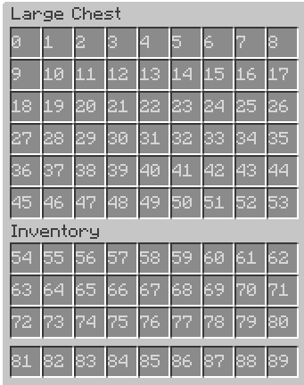

# mineflayer-telegram
Minecraft telegram bot, for anarchy servers based on mineflayer

<h1>Installing</h1>
1. Install node js  
2. <code>npm install mineflayer</code>  
3. <code>npm install node-telegram-bot-api</code>  
4. run it by <code>node bot.js</code>  

<h1>How to use❓</h1>
Rename <code>config_empty.js</code> to <code>config.js</code>.In <code>config.js</code> enter your bot properties, telegram bot token, your telegram id etc..
Bot is writed for server holyworld, so for example Enter function can work properly only on holyworld.
To bypass botfilter you need to login from bot account (on real Minecraft) from your ip, then you can use it without any problems till server restart (on same ip).

<h1>Functions</h1>
All functions already on bot panel. To send message in server chat just send it to telegram bot.
Bot logs messages in chat(works not very properly) and logs players showing up (and cords) and when they leaves from bot field of vision
Also you can check near players, bot coords

<h1>How to enter server to holyworld❓</h1>
</img>
Choose it by this image and follow your number on EnterServer function  
<code>bot.clickWindow(24, 0, 0)</code>
